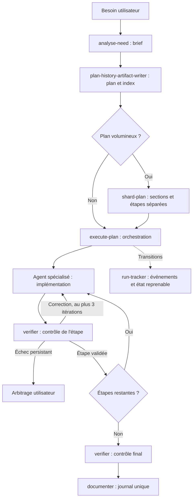

# Workflow IA inspiré de BMAD

Workflow de développement assisté par IA : du besoin au plan exécutable, puis à l'implémentation vérifiée et au journal d'exécution.

Le dépôt rassemble les instructions pour permettre leur réutilisation et leur évolution indépendamment d'une application. Les agents utilisent la stack, les chemins et les règles du projet cible. Ils chargent directement les deux skills officiels de Ponytail 5.0.0, conservés sans modification ; voir [les agents](.claude/agents/README.md), [l'attribution](NOTICE.md) et [le guide de portage](docs/PORTAGE.md). Le code applicatif, les conversations et l'historique métier ne sont pas embarqués.

## Le parcours



Une étape de décision ou un geste matériel passe par l'utilisateur. L'orchestrateur reste dans la conversation principale ; les agents travaillent dans des contextes isolés.

## Contenu

| Élément | Rôle |
|---|---|
| [analyse-need](.claude/skills/analyse-need/SKILL.md) | Clarifier un besoin et conserver un brief avant la planification |
| [plan-history-artifact-writer](.claude/skills/plan-history-artifact-writer/SKILL.md) | Produire un plan autonome, consulter l'historique, tenir les index |
| [shard-plan](.claude/skills/shard-plan/SKILL.md) | Découper un grand plan et permettre sa lecture incrémentale |
| [execute-plan](.claude/skills/execute-plan/SKILL.md) | Router les étapes, piloter les corrections, vérifier et clôturer |
| [Équipe d'agents](.claude/agents/README.md) | Implémenteurs backend, frontend et intégration ; vérificateur et documentaliste ; variantes de modèle/effort |
| [Adaptateur commun](.claude/agents/references/implementation.md) | Chargement de Ponytail officiel, autorisations et rapport implementer |
| [Intégration Ponytail](docs/PONYTAIL_INTEGRATION.md) | Sources officielles inchangées, version épinglée et différences d’interface |
| [Suivi d'exécution](tools/history/README.md) | CLI Node sans dépendance, journal JSONL et instantané JSON, interruptions et reprises |
| [screen-composition](.claude/skills/screen-composition/README.md) | Compagnon facultatif de composition fonctionnelle des interfaces |
| [Benchmarks](documentation/history/benchmarks/execute-plan-profiles/README.md) | Protocoles, oracles et résultats historiques ayant guidé les profils d'agents |

Les templates et scénarios d'évaluation des skills sont conservés. Les exemples du suivi sont des fixtures de démonstration, pas les états d'exécution privés du projet.

## Essayer l'outillage

Git et Node.js sont nécessaires pour ces commandes. Aucun `npm install` n'est requis.

```powershell
git clone https://github.com/alexandre-plana/bmad-inspired-workflow.git
cd bmad-inspired-workflow
node tools/history/run-tracker.mjs help
node --test tools/history/run-tracker.test.mjs tools/ponytail/vendor.test.mjs
```

Le CLI suit une exécution ; il ne lance pas lui-même les agents. Les skills et agents utilisent les conventions de Claude Code. Leur adaptation à un autre moteur d'agents est décrite dans [PORTAGE.md](docs/PORTAGE.md).

## Installer dans un projet

1. Lire [le guide de portage](docs/PORTAGE.md) et choisir les rôles, chemins, règles de domaine et commandes de validation du projet cible.
2. Copier les quatre skills du cœur dans son `.claude/skills/` et les agents nécessaires dans `.claude/agents/`, avec `references/implementation.md`. Conserver les sous-dossiers `assets/` et `evals/` des skills, ainsi que `NOTICE.md`, `docs/PONYTAIL_INTEGRATION.md` et **tout `third_party/ponytail/`**, qui contient les sources obligatoires.
3. Copier `tools/history/` au même emplacement et les conventions de `documentation/history/` ; commencer avec des index vides.
4. Fournir les périmètres, critères et commandes du projet. Fusionner les consignes de routage dans son `CLAUDE.md` existant.
5. Vérifier les tests du CLI, puis exécuter un petit plan réel pour vérifier le routage, les permissions et les contrôles du projet.

Exemples de demandes à l'assistant après adaptation :

- « Analyse le besoin d'un centre de notifications et écris un brief. »
- « Rédige un plan exécutable à partir de ce brief. »
- « Découpe ce plan pour une lecture par étapes. »
- « Exécute ce plan avec le profil hérité. »
- « Reprends l'exécution interrompue de ce plan. »

## État de l'extraction

Extraction du 8 octobre 2026, à partir du commit source `d4dbafc86606a976eec3e195b244c91b101cc365`. Les noms du projet d'origine ont été neutralisés. La liste des 85 fichiers extraits, leurs empreintes SHA-256 d'origine (`sourceSha256`) et leurs empreintes actuelles (`sha256`) figurent dans [extraction-manifest.json](extraction-manifest.json).

Les 20 tests automatisés du suivi d’exécution et les deux tests d’intégrité de l’import Ponytail passent. Les empreintes SHA-256 et les blobs Git garantissent la fidélité des fichiers importés. Cinq [scénarios d'agents](evals/agents/README.md) évaluent les décisions attendues des contrats génériques par simulation en lecture seule. Les campagnes de benchmarks historiques ne sont pas rejouées ; leurs tarifs et noms de modèles sont des données historiques, à vérifier avant utilisation.

Certaines évolutions envisagées, notamment le tableau des chantiers et la clôture enrichie, ne sont pas implémentées dans ce snapshot. Le [contrat du suivi](tools/history/README.md#9-compatibilité-et-suites) précise cette limite.

## Origine

Ce workflow est inspiré de BMAD et conserve son implémentation locale, sans installer BMAD, CIS ou TEA. Ce dépôt n'est pas une distribution officielle de ces projets. Les sources officielles de Ponytail conservent leur notice MIT ; aucune licence générale n'est attribuée aux autres fichiers extraits. Voir [la provenance](docs/PROVENANCE.md) et [NOTICE](NOTICE.md).
