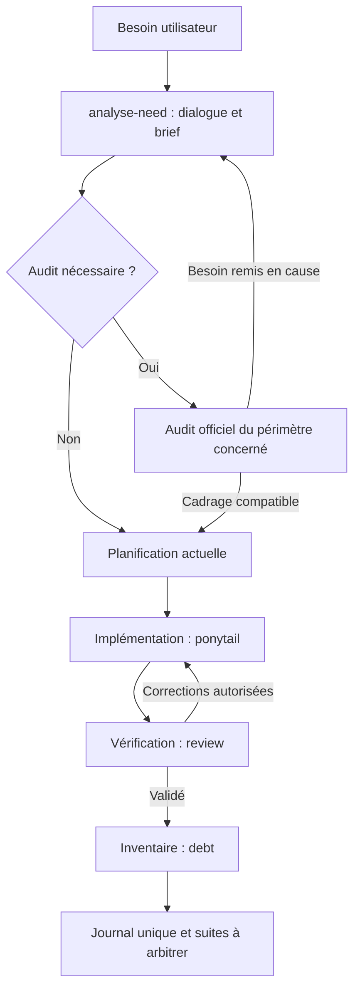

# Réutilisation directe de Ponytail 5.0

Notre workflow conserve le dialogue `analyse-need`, le brief, la planification,
l'orchestration et le journal. Les méthodes techniques sont chargées directement
depuis les fichiers Ponytail officiels, sans traduction ni reformulation locale.

## Sources et intégrité

- Dépôt : [DietrichGebert/ponytail](https://github.com/DietrichGebert/ponytail/tree/v5.0.0).
- Version : `v5.0.0`, commit `b088b2df6e08d4306c6a3c3d575fe38c2d2d2989`.
- Distribution source complète : les 199 fichiers du commit sous [third_party/ponytail](../third_party/ponytail/README.md), sans son historique Git.
- [upstream-lock.json](../third_party/ponytail/upstream-lock.json) est la seule métadonnée locale de ce dossier : chemins, modes, SHA-256, blobs et arbre Git officiel `cd94f9b4abb6ff6e65055b0076e82a5b13c693aa`.
- `.gitattributes` conserve les octets upstream, y compris frontmatter et fins de ligne. Aucun fichier officiel n'est édité.

```powershell
node --test tools/ponytail/vendor.test.mjs
```

Les contrôles reconstruisent l'arbre Git attendu et comparent chaque fichier au
blob officiel : retirer une source du disque et du lock ne masque pas un import
incomplet. Une mise à jour choisit explicitement une version/commit, importe
son arbre complet et vérifie les adaptateurs. Recalculer les empreintes après
une édition locale ne constitue pas une mise à jour upstream.

## Parcours et chaîne de chargement



| Fonction | Chargement depuis planningRoot | Place |
|---|---|---|
| Implémentation | Agent de base → `references/implementation.md` → [ponytail](../third_party/ponytail/skills/ponytail/SKILL.md) | Chaque étape d'implémentation |
| Vérification | Agent de base → [review](../third_party/ponytail/skills/ponytail-review/SKILL.md) | Étapes et contrôle final |
| Audit | [ponytail-tools](../.claude/skills/ponytail-tools/SKILL.md) → [audit](../third_party/ponytail/skills/ponytail-audit/SKILL.md) | Conditionnel, après cadrage et avant plan ; ou demande autonome |
| Dette | `ponytail-tools` → [debt](../third_party/ponytail/skills/ponytail-debt/SKILL.md) | Après contrôle final, avant journal ; ou demande autonome |
| Aide | `ponytail-tools` → [help](../third_party/ponytail/skills/ponytail-help/SKILL.md) | À la demande |
| Benchmarks | `ponytail-tools` → [gain](../third_party/ponytail/skills/ponytail-gain/SKILL.md) | À la demande, chiffres upstream uniquement |

Lire intégralement la source utile ; les six skills ne sont pas chargés à chaque
étape. Le checkout cible peut différer du dépôt de planification. Une source
absente bloque l'action concernée, avec son chemin et sa cause ; aucun résumé
local ne la remplace.

## Le brief garde l'autorité sur le besoin

`analyse-need` conserve son dialogue, ses questions et son brief court. Son
inspection initiale reste superficielle. Un audit distinct est pertinent pour
une demande explicite, une limite qui menace les critères du besoin ou une
reprise/refonte au comportement incertain. Il porte sur le périmètre nommé,
sans audit global automatique pour une petite évolution ou un petit fix.

Le rapport original apporte des constats techniques, leur couverture et leurs
hypothèses de charge au writer. Celui-ci rattache les travaux retenus au brief.
Les recommandations hors périmètre restent des suites à arbitrer. Si l'audit
invalide le besoin, une contrainte critique ou le périmètre, revenir au dialogue
avant de figer un plan exécutable. Ni un verdict d'audit ni la rédaction du plan
ne valident artificiellement un brief. Une instruction explicite déjà donnée
de suivre le plan malgré une divergence est conservée et consignée.

## Bilan de dette et journal

En clôture, l'orchestrateur lit le skill debt officiel et scanne chaque checkout
où du code, des tests ou une configuration exécutable ont été modifiés. La liste
vient des rapports de toutes les itérations, y compris celles avant une reprise ;
les autres dépôts déclarés ne sont pas scannés implicitement. Une exécution
strictement statique produit `not-applicable` et sa raison. Une demande autonome
de dette peut viser tout checkout explicitement désigné.

Le rapport original et sa couverture sont transmis au documentaliste et inclus
dans le journal unique. Aucun champ ou rôle n'est ajouté au tracker, aucun
fichier de dette autonome n'est écrit sans autorisation de persistance. Après
interruption avant clôture, refaire le scan sur l'état courant.

Les marqueurs tiers sont identifiés par leur provenance. Zéro marqueur signifie
zéro compromis marqué trouvé, pas zéro dette technique. `no-trigger` signale un
point à arbitrer. Un scan impossible est `not-checked` avec cause. Si le plan
exige le bilan comme contrôle, résoudre son impossibilité ou obtenir l'arbitrage
avant de clore comme terminé ; sinon, conserver la limite dans le journal. Le
bilan ne neutralise jamais un échec de vérification ; une limite dépassée qui
menace un critère requis revient au verifier avant clôture.

## Adaptations limitées à l'interface

| Interface | Règle locale |
|---|---|
| Autorisations | Les changements nécessaires restent dans les chemins autorisés ; toute extension est remontée à l'orchestrateur |
| Invocation | Implémenteurs en `full` par défaut dans leur contexte ; aucune modification de configuration ou d'autres conversations |
| Sortie implementer | Rapport structuré dans la langue du projet, contrôles et limites, non-vérifié et risque en fin |
| Sortie verifier | Rapport source complet, catégories et numéros conservés, puis traduction séparée vers le tracker |
| Contrôles | Commandes indépendantes ; modes `docs-config`, `step`, `final` ; contrôle requis impossible bloquant |
| Cycle de vie | Trois itérations maximum, suivi par l'orchestrateur, journal unique par le documentaliste |
| Audit et dette | Sources originales en lecture seule ; résultats raccordés au brief/plan et à la clôture |

Le commentaire `ponytail:` à limite connue reste exigé par la source. Pour la
revue, conserver `Must fix`, `Should fix`, `Nice to have` et le verdict original.
Les constats dont ce verdict exige la correction deviennent bloquants ; les
autres recommandations ne sont reportées que si les critères le permettent.
Les échecs de contrôles locaux requis sont ajoutés séparément.

## Hooks optionnels

Les hooks, manifests et adaptateurs d'hôtes officiels sont présents dans la
distribution ; leur présence sous `third_party/` n'enregistre pas le plugin
auprès de l'hôte. Le parcours décrit ci-dessus fonctionne par lecture explicite
des skills, sans activation de session globale. `help` et `gain` ne changent
ni configuration ni mode.

Une installation explicitement demandée suit le
[INSTALL officiel épinglé](../third_party/ponytail/INSTALL.md). Le runtime upstream
requiert Node.js pour ses hooks. Il propose l'injection au démarrage, le suivi
des modes, l'injection dans les sous-agents et une cartographie du code.

- `PONYTAIL_DEFAULT_MODE` ou la configuration upstream règlent le mode par défaut : `lite`, `full`, `ultra`, `off`. Upstream choisit `full` si aucun réglage n'est fourni.
- Choisir `off` si l'on conserve uniquement notre chargement explicite et que l'on souhaite éviter l'injection automatique au démarrage.
- Si l'injection dans les sous-agents est activée, `PONYTAIL_SUBAGENT_MATCHER` peut filtrer les rôles. Attention à la sémantique officielle : sans filtre, tous les sous-agents sont visés ; un type inconnu ou un filtre invalide peut revenir à l'injection. Ce filtre ne garantit donc pas à lui seul l'isolement de nos rôles.
- Évaluer le comportement session/orchestrateur/verifier après activation : notre routage fournit déjà les sources aux agents concernés. Ne pas ajouter une deuxième implémentation locale des hooks.
- Conserver la version épinglée ; une mise à jour globale du plugin n'est pas une mise à jour automatique de cette copie.

Ces réglages sont documentés, pas appliqués à la configuration utilisateur par
ce dépôt. Licence : [NOTICE](../NOTICE.md) et [MIT originale](../third_party/ponytail/LICENSE).
Les tests d'intégrité prouvent la fidélité de l'import ; les simulations de
contrats ne prouvent pas l'obéissance parfaite d'un modèle ou un gain mesuré.
